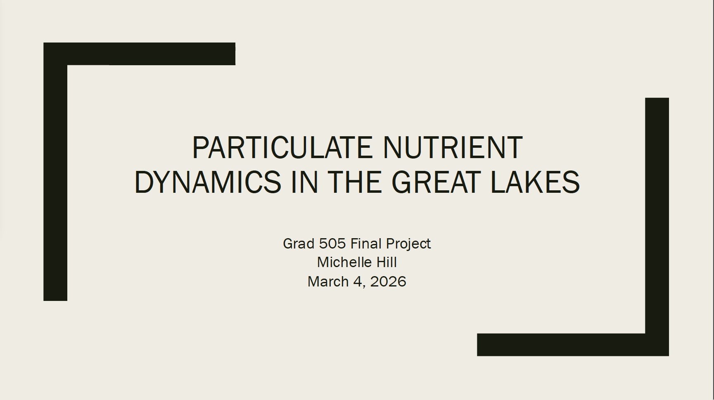

# Foundations in Data Science

This project explores nutrient trends and lake classification using EPA Great Lakes data.

## Watch the Final Project Presentation

🎥 

## Skills Demonstrated

- Data Cleaning
- Exploratory Data Analysis
- Statistical Hypothesis Testing
- Logistic Regression
- Classification Modeling
- Data Visualization
- R Programming
- Research Communication

## Lessons Learned

The most important lesson from this project was learning how statistical significance differs from practical significance. Building predictive models required balancing technical rigor with the ability to communicate findings to non-technical audiences.

## Project Components

- Data cleaning and preparation
- Exploratory data analysis
- Regression modeling
- Multinomial logistic classification
- Anomaly detection
